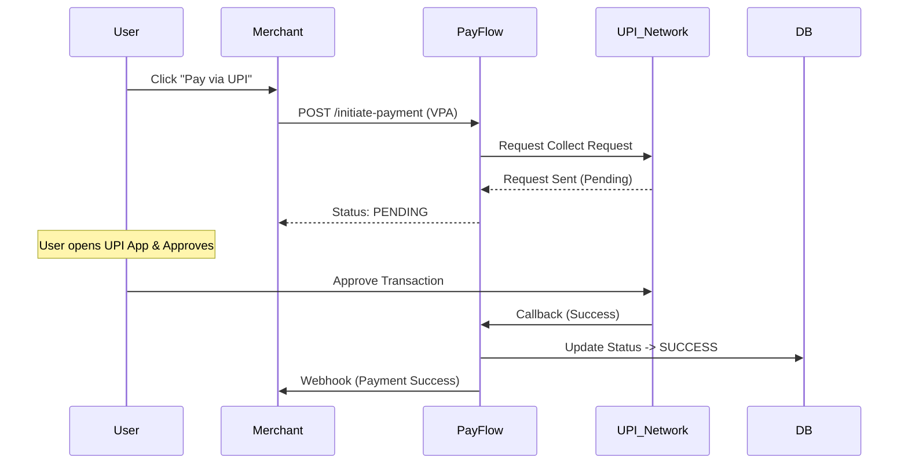

# PayFlow – System Design Document

**Version:** 1.0  
**Status:** Draft  
**Author:** Engineering Team  
**Date:** 2025-12-16  

---

## 1. High-Level Architecture

PayFlow acts as a **Payment Gateway / Switch** that sits between a Merchant and the Core Banking Networks.

```mermaid
graph TD
    Client[User / Client App] -->|Initiate Payment| API[PayFlow API (Backend)]
    API -->|Store Txn| DB[(PostgreSQL)]
    API -->|Route Request| MockGW[Mock Banking Network]
    MockGW -->|Simulate Bank Response| API
    API -->|Webhook Update| MerchantServer[Merchant Backend]
    
    MerchantUser[Merchant Dashboard User] -->|View Analytics| Dashboard[Frontend App]
    Dashboard -->|Fetch Metrics| API
```

## 2. Payment Transaction Flows

### 2.1. Standard Payment Flow (Generic)
1. **Initiation:** Merchant calls `/initiate-payment` with amount, currency, order_id.
2. **Creation:** PayFlow creates a `Transaction` record (Status: `CREATED`) and returns a `payment_link` or `token`.
3. **User Action:** User enters details (Card/UPI) on the checkout page.
4. **Processing:** PayFlow simulates communicating with a Bank.
5. **Completion:** Bank responds (Success/Fail). PayFlow updates DB (Status: `SUCCESS`/`FAILED`).
6. **Notification:** PayFlow sends a webhook to the Merchant.

### 2.2. UPI Collect Flow (Simulated)


### 2.3. Card Payment Flow (3D Secure)
1. **Auth:** User enters card details.
2. **Challenge:** User redirected to OTP page (Simulated).
3. **Verification:** User enters OTP.
   - **Scenario A (Correct OTP):** Transaction -> `DoCapture` -> `SUCCESS`.
   - **Scenario B (Wrong OTP):** Transaction -> `AuthFailed` -> `FAILED`.
   - **Scenario C (Timeout):** User closes window -> `DROPPED`.

## 3. Database Schema

We use **PostgreSQL** for relational integrity.

### `merchants`
- `id` (UUID, PK)
- `name` (String)
- `api_key` (String, Indexed)
- `webhook_url` (String)

### `transactions`
- `id` (UUID, PK)
- `merchant_id` (FK)
- `order_id` (String, Merchant Provided)
- `amount` (Float)
- `currency` (String)
- `status` (Enum: CREATED, PENDING, SUCCESS, FAILED, REFUNDED)
- `method` (Enum: UPI, CARD, NETBANKING)
- `failure_reason` (String, Nullable)
- `created_at` (Timestamp)
- `updated_at` (Timestamp)

### `settlements`
- `id` (UUID, PK)
- `merchant_id` (FK)
- `total_amount` (Float)
- `cycle_date` (Date)
- `status` (Enum: PROCESSED, PENDING)

## 4. API Design

### Base URL: `https://api.payflow.com/v1`

### 4.1. Initiate Payment
- **POST** `/payment/initiate`
- **Headers:** `X-API-KEY: <merchant_key>`
- **Body:**
  ```json
  {
    "amount": 100.00,
    "currency": "INR",
    "order_id": "ord_123456",
    "customer_vpa": "user@upi" // Optional
  }
  ```
- **Response:**
  ```json
  {
    "transaction_id": "txn_987654",
    "status": "CREATED",
    "payment_link": "https://payflow.com/pay/txn_987654"
  }
  ```

### 4.2. Get Status
- **GET** `/payment/status/{transaction_id}`
- **Response:**
  ```json
  {
    "transaction_id": "txn_987654",
    "status": "FAILED",
    "failure_reason": "INSUFFICIENT_FUNDS",
    "retry_allowed": true
  }
  ```

## 5. Reliability & Failure Handling

### 5.1. Idempotency
- Merchants **MUST** send an `Idempotency-Key` header for state-changing requests (Initiate, Refund).
- PayFlow caches the key for 24 hours. If a duplicate key is seen, return the *previous* response without re-processing.

### 5.2. Webhook Retries
- If the Merchant's server returns anything other than `200 OK`, PayFlow retries the webhook with exponential backoff:
  - Attempt 1: Immediate
  - Attempt 2: +30s
  - Attempt 3: +5m
  - Attempt 4: +1h
- After 4 failures, the webhook is marked `failed`.
